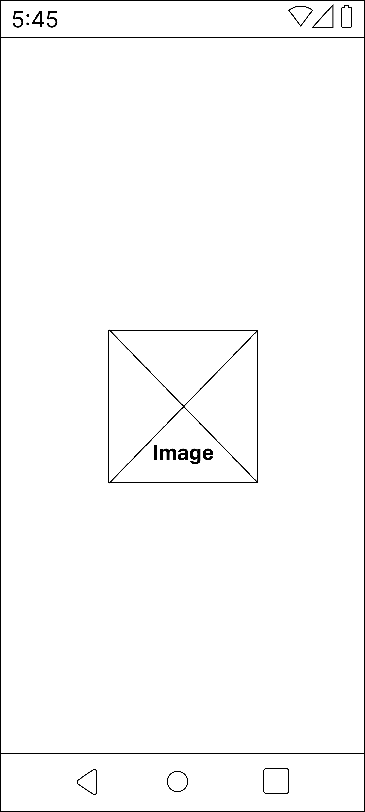
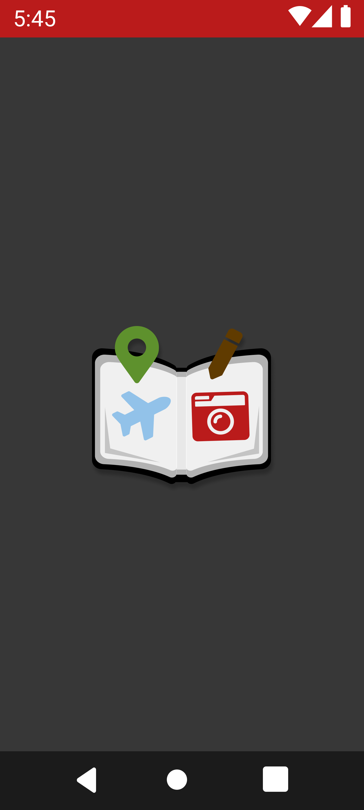
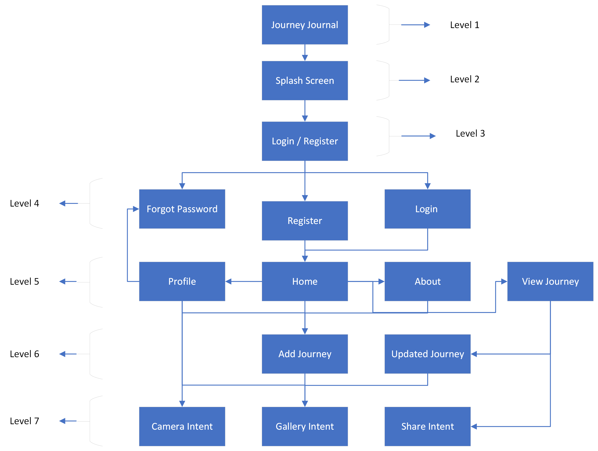
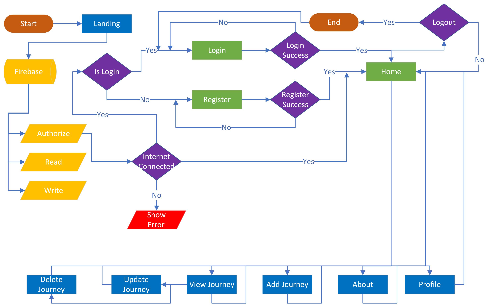

<!-- markdownlint-disable MD041 -->
<!-- markdownlint-disable MD033 -->

    
    

    

# **JourneyJournal** 📱

A Complete Journey Tracking Android Application in partial fulfillment of level six at [**Ismt College**]("https://www.ismt.edu.np/) under Android Mobile Development Course CET343, [**University of Sunderland**](https://www.sunderland.ac.uk/). 🏫🎓

## **Table of Contents**

- [**JourneyJournal** 📱](#journeyjournal-)
  - [**Table of Contents**](#table-of-contents)
  - [**Scenario**](#scenario)
    - [**Typical User Interaction**](#typical-user-interaction)
    - [**The prototype**](#the-prototype)
  - [**Application Design**](#application-design)
    - [**Wireframe**](#wireframe)
    - [**Design Mockup**](#design-mockup)
    - [**Application Screen Hierarchy**](#application-screen-hierarchy)
    - [**Application Flow Chart**](#application-flow-chart)
  - [**TODO**](#todo)

## **Scenario**

You have been commissioned to create an app that will help people document their travel experiences. This app will store a list of travel related journal entries, as well as pictures they have associated with each entry. The app will also have scope to geotag the journal entries, as well as interact with other native applications and hardware, such as the camera.

### **Typical User Interaction**

Walter has just embarked on a round the world travel adventure. He is trying to think of an easy way to document his travel experiences. He decides to download an app, and after looking through the PlayStore, decides on JourneyJournal.

After installing and then opening the app, he is prompted to either register or login. He notices a number of registration options but decides to use traditional email and password. Once he has registered, he is automatically logged in and is then presented with the apps homepage area. It is here he can see his journal feed, which is currently empty. He presses the option to enter his first journal entry. He is taken to a screen where he can record his thoughts as text, and enter a title of the journal entry. He notices he can also add a photo to the journal entry, so he presses on this option. An option is now presented to either select an image from the phone, or open the camera to take a new photograph. He takes a new photo and adds this to his entry. The final option before completing the journal entry is to record his location. He decides to do this and presses on the option. He is then presented with a map that loads his current location, but he is also able to change the location by moving the map. Once he has selected his location, he is taken back to the journal entry screen. He then saves his entry.

He is taken back to the main screen for the app where he can see a preview of his first entry, and it shows the title, his photo, and the date and time of the entry. He clicks back into the entry and notices an option to edit or delete the entry. He also notices the option to share this entry to social media apps that he has installed on his device and decides to test his out by sharing his entry to the twitter app as a tweet.

He finishes using the app and signs out.

### **The prototype**

Core requirements of the app:

1. User registration and login.
1. Main home area of the app.
1. Create a journal entry.
1. Manage my journal entries.
1. Delete entry.
1. Edit entry.

Optional Desirable Requirements for the app:

1. The ability to Geotag a journal entry so the location of the entry can be recorded and then viewed on a map.
1. The ability to allow integration with other apps and hardware, such as social media and the camera.

**Note 📓:** There is no associated logo or house style for this app yet so you have free reign over the appearance, but pay particular attention to Material Design.

## **Application Design**

Application design process initiates with wireframe creation, design mockup, prototyping and app screen hierarchy creation and many more. Find the Link of [**Figma Project**](https://www.figma.com/file/3MOnQyiwSPvJOrVgHTfXAk/Journey-Journal) where different layers have different implementations.

### **Wireframe**

Wireframe of the app is created using [**Figma**](https://www.figma.com/proto/3MOnQyiwSPvJOrVgHTfXAk/Journey-Journal?page-id=68%3A9&node-id=112%3A5398&viewport=309%2C48%2C0.31&scaling=min-zoom&starting-point-node-id=112%3A5379). Click on image below to see an interactive wireframe of application.

### **Design Mockup**

Design mockup of app is created using **Figma**. Click on image below to see an interactive design mockup of application in light mode.

Click on image below to see an interactive design mockup of application in dark mode.
                            

                  
                  
### **Application Screen Hierarchy**

The figure below shows the application screen hierarchy.

### **Application Flow Chart**

The figure below shows the application flow chart.

## **TODO**

1. Receive data from other apps using intent filters and show it on Add Journey Page.
1. Add a map to the journal entry and updated screen.
1. Add swipe to delete, update and share functionality.
1. Implement Share image with other apps. Although, text is shared but better if image is also shared.
1. Implement SignUp and Login with Twitter and Google.
1. Implement offline cashing and room database implementation.
